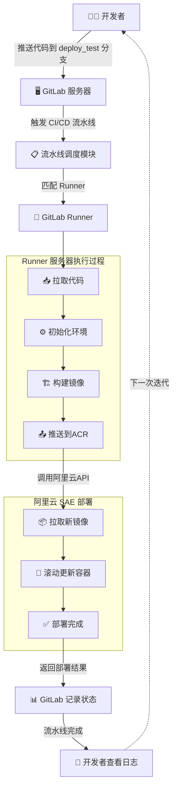

# GitLab CI/CD 原理详解

## 核心概念

GitLab CI/CD 的核心工作流是 **调度与执行分离** 的架构：

| 组件 | 职责 |
|------|------|
| **GitLab 服务器** | 负责 **触发、调度、记录**，不做具体的执行 |
| **Runner 服务器** | 负责 **拉取代码、执行脚本、调用外部服务**，是实际的执行节点 |

> 💡 **Runner 服务器可以是任意服务器**（本地电脑、云服务器等），只要满足：
> - 能与 GitLab 服务器网络互通
> - 安装了对应的依赖（如 Docker、阿里云 CLI 等）

---

## 完整工作流程图

以下是 GitLab CI/CD 结合阿里云 Serverless（SAE）部署的完整流程：



---

## 流程分解说明

### 1️⃣ 代码推送与触发

```
开发者 → 推送代码到 deploy_test 分支 → GitLab 服务器检测到推送
```

- GitLab 服务器监听代码仓库的变更
- 根据 `.gitlab-ci.yml` 中定义的规则判断是否触发流水线

### 2️⃣ 流水线调度

```
GitLab 服务器 → 解析 .gitlab-ci.yml → 匹配合适的 Runner
```

- GitLab 根据 `.gitlab-ci.yml` 中定义的 `tags` 标签匹配可用的 Runner
- 将任务分发给匹配的 Runner 执行

### 3️⃣ Runner 执行构建任务

```
Runner 服务器 → 拉取代码 → 执行 before_script → 构建镜像 → 推送到 ACR
```

| 步骤 | 说明 |
|------|------|
| 拉取代码 | Runner 从 GitLab 拉取指定分支的最新代码 |
| before_script | 初始化环境，如配置阿里云 CLI、登录 ACR 镜像仓库 |
| 构建镜像 | 根据 Dockerfile 构建 Docker 镜像 |
| 推送 ACR | 将构建好的镜像推送到阿里云容器镜像服务（ACR） |

### 4️⃣ 部署到阿里云 SAE

```
Runner → 调用阿里云 API → SAE 拉取新镜像 → 滚动更新容器
```

| 步骤 | 说明 |
|------|------|
| 调用阿里云 API | Runner 通过阿里云 CLI 通知 SAE 进行部署 |
| SAE 拉取镜像 | SAE 从 ACR 拉取最新的镜像 |
| 滚动更新 | SAE 停止旧版本容器，启动新版本容器 |
| 返回结果 | 部署完成后，SAE 返回部署结果给 Runner |

### 5️⃣ 记录与反馈

```
Runner → 返回结果给 GitLab → GitLab 记录流水线状态 → 开发者查看日志
```

- GitLab 服务器记录本次流水线的执行状态（成功/失败）
- 开发者可以在 GitLab Web 界面查看详细的执行日志和状态

---

## 关键文件：.gitlab-ci.yml

`.gitlab-ci.yml` 是 CI/CD 的核心配置文件，定义了流水线的所有行为：

```yaml
# 示例配置
stages:
  - build
  - deploy

# 构建镜像阶段
build_image:
  stage: build
  tags:
    - docker-runner  # 匹配带有此标签的 Runner
  script:
    - docker build -t $ACR_REGISTRY/$IMAGE_NAME:$CI_COMMIT_SHA .
    - docker push $ACR_REGISTRY/$IMAGE_NAME:$CI_COMMIT_SHA
  only:
    - deploy_test  # 只在 deploy_test 分支触发

# 部署阶段
deploy_sae:
  stage: deploy
  tags:
    - docker-runner
  script:
    - aliyun sae UpdateAppConfig --AppId $SAE_APP_ID --ImageUrl $ACR_REGISTRY/$IMAGE_NAME:$CI_COMMIT_SHA
  only:
    - deploy_test
```

---

## 总结

| 环节 | 负责方 | 具体工作 |
|------|--------|----------|
| 触发流水线 | GitLab 服务器 | 监听代码推送，解析 CI 配置 |
| 任务调度 | GitLab 服务器 | 匹配 Runner，分发任务 |
| 拉取代码 | Runner 服务器 | 从 GitLab 获取最新代码 |
| 构建镜像 | Runner 服务器 | 执行 Docker build |
| 推送镜像 | Runner 服务器 | 上传到 ACR |
| 触发部署 | Runner 服务器 | 调用阿里云 SAE API |
| 执行部署 | 阿里云 SAE | 拉取镜像，更新容器 |
| 记录状态 | GitLab 服务器 | 保存流水线执行结果 |
| 查看结果 | 开发者 | 在 GitLab 查看日志和状态 |

