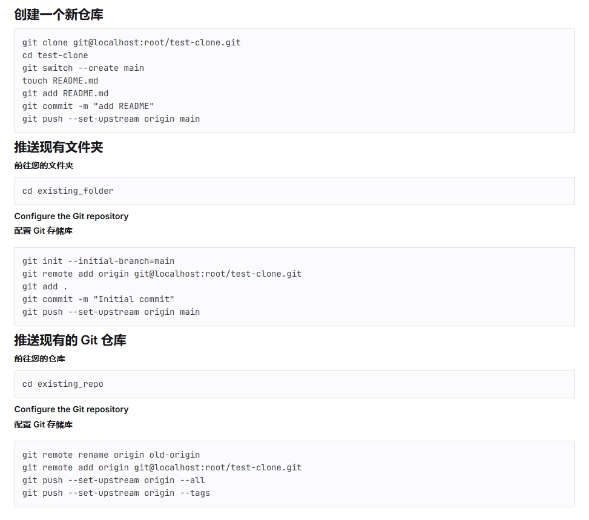

# GitLab Docker 部署

通过 Docker Compose 快速部署 GitLab 社区版的完整解决方案。

## 部署方案选择

本仓库提供两种部署方案，位于 `deploy/` 目录下：

| 方案 | 目录 | 适用场景 | 特点 |
|------|------|----------|------|
| **本地部署** | `deploy/local/` | 个人学习、内网协作 | 支持集成/分离两种模式 |
| **云部署** | `deploy/cloud/` | 团队协作、生产环境 | 外置云数据库，高可用 |

### 目录结构

```
gitlab-docker/
├── deploy/
│   ├── local/                        # 本地部署
│   │   ├── docker-compose.yml        # 集成模式配置
│   │   ├── docker-compose.separated.yml  # 分离模式配置
│   │   ├── start.ps1 / start.sh      # 启动脚本
│   │   ├── stop.ps1 / stop.sh        # 停止脚本
│   │   └── README.md
│   │
│   └── cloud/                        # 云部署
│       ├── docker-compose.yml        # 云数据库配置
│       ├── .env.example              # 环境变量模板
│       ├── install.sh                # ECS 环境安装
│       ├── start.sh / stop.sh        # 启停脚本
│       ├── backup.sh / restore.sh    # OSS 备份恢复
│       ├── init-database.sql         # RDS 初始化 SQL
│       └── README.md
│
├── GitLab-CICD原理.md               # CI/CD 工作流程详解
├── gitlab仓库的远程与本地绑定.png    # SSH 配置示意图
└── README.md                        # 本文档
```

### 本地部署模式

本地部署支持两种模式，可随时切换：

| 模式 | 配置文件 | 说明 |
|------|----------|------|
| **集成模式** | `docker-compose.yml` | 内置 PostgreSQL/Redis，开箱即用 |
| **分离模式** | `docker-compose.separated.yml` | 独立数据库容器，便于管理 |

---

## 快速开始

### 本地部署（推荐新手）

```bash
cd deploy/local

# Windows (PowerShell)
.\start.ps1

# Linux/macOS
chmod +x start.sh && ./start.sh
```

启动脚本会提示选择部署模式（集成/分离）。

### 云部署

```bash
# 上传到 ECS
scp -r deploy/cloud/* root@your-ecs:/opt/gitlab/

# SSH 登录后
cd /opt/gitlab
./install.sh  # 安装环境
vi .env       # 修改配置
./start.sh    # 启动服务
```

详细说明请查看各目录下的 README.md。

---

## 访问信息

| 项目 | 本地部署 | 云部署 |
|------|----------|--------|
| Web 地址 | http://localhost:9980 | http://your-domain |
| SSH 端口 | 9922 | 22 |
| 用户名 | root | root |

### 获取初始密码

```bash
docker exec gitlab cat /etc/gitlab/initial_root_password
```

---

## 系统要求

| 配置项 | 最小要求 | 推荐配置 |
|--------|----------|----------|
| 内存 | 4GB | 8GB+ |
| CPU | 2核 | 4核+ |
| 存储 | 10GB | 50GB+ |
| 系统 | Windows 10+/Linux/macOS | - |

---

## 常用命令

```bash
# 查看服务状态
docker-compose ps

# 查看日志
docker-compose logs -f gitlab

# 重启服务
docker-compose restart

# 创建备份
docker exec gitlab gitlab-backup create

# 进入容器
docker exec -it gitlab bash

# 检查组件状态
docker exec gitlab gitlab-ctl status
```

---

## 仓库连接配置

### SSH 密钥配置

生成 SSH 密钥（避免覆盖已有密钥）：

```bash
ssh-keygen -t rsa -C "your-email@example.com" -f ~/.ssh/id_rsa_gitlab
```

配置 `~/.ssh/config`：

```
Host localhost
    User git
    Port 9922
    IdentityFile ~/.ssh/id_rsa_gitlab
```

测试连接：

```bash
ssh -T git@localhost -p 9922
```

### 绑定远程仓库



---

## 故障排除

### GitLab 无法启动

1. 检查内存是否足够（至少 4GB）
2. 确保端口未被占用
3. 查看日志：`docker-compose logs gitlab`

### 忘记 root 密码

```bash
docker exec -it gitlab bash
gitlab-rails console -e production

# 在控制台中执行
user = User.find_by(username: 'root')
user.password = '新密码'
user.password_confirmation = '新密码'
user.save!
exit
```

> 密码要求：字母+数字，不低于 8 位

### push 时报错 dubious ownership

```bash
docker exec gitlab chown -R git:git /var/opt/gitlab/git-data/repositories/
```

### Webhook 报错 local network not allowed

进入 Admin area → Settings → Network → Outbound requests，勾选允许对本地的请求。

---

## 容器间通信

如需容器间通信，创建自定义网络：

```bash
docker network create gitlab_network
```

在 `docker-compose.yml` 中配置：

```yaml
services:
  your-service:
    networks:
      - gitlab_network

networks:
  gitlab_network:
    external: true
    name: gitlab_network
```

---

## 其他注意事项

- 仓库需设置 `user.name` 和 `user.email` 与 GitLab 账号一致
- 仓库用户需要有 **维护者** 角色才能 push
- 语言切换：登录后在 Preference 中修改


# 额外提醒

## 容器之间互相通信

如果要容器之间互相通信，建议创建自定义网络，比如：

```bash
docker network create gitlab_network
```

并在docker-compose.yml中进行更改：

```config
services:
  serviceA:
    image: nginx
    networks:
      - gitlab_network

networks:
  gitlab_network:
    external: true
    name: gitlab_network
```

```config
services:
  serviceB:
    image: nginx
    networks:
      - gitlab_network

networks:
  gitlab_network:
    external: true
    name: gitlab_network
```

容器 A 可以通过服务名称 serviceB 访问容器 B。例如，如果容器 B 是一个 Web 服务，容器 A 可以通过以下方式访问容器 B：
```bash
curl http://serviceB
```

## 配置webhook报错

### Urlis blocked: Requests to the local network are not allowed

进入 Admin area => Settings => Network ，然后点击 Outbound requests 右边 的“expand”按钮，勾选允许对本地的请求，并点击 Save changes按钮即可

## 检查 GitLab 各组件运行状态的命令

```
# gitlab-ctl status
run: gitaly: (pid 306) 266s; run: log: (pid 302) 266s
run: gitlab-kas: (pid 309) 266s; run: log: (pid 394) 265s
run: gitlab-workhorse: (pid 608) 240s; run: log: (pid 517) 245s
run: logrotate: (pid 307) 266s; run: log: (pid 300) 266s
run: nginx: (pid 526) 242s; run: log: (pid 625) 239s
run: postgresql: (pid 310) 266s; run: log: (pid 303) 266s
run: puma: (pid 646) 237s; run: log: (pid 412) 259s
run: redis: (pid 305) 266s; run: log: (pid 301) 266s
run: sidekiq: (pid 663) 232s; run: log: (pid 434) 253s
run: sshd: (pid 33) 277s; run: log: (pid 32) 277s
```

## 问题总结

- push时报错：
```
[info] fatal: detected dubious ownership in repository at '/var/opt/gitlab/git-data/repositories/@hashed/d4/73/d4735e3a265e16eee03f59718b9b5d03019c07d8b6c51f90da3a666eec13ab35.git'
```
原因在于'/var/opt/gitlab/git-data/repositories/@hashed/d4/73/d4735e3a265e16eee03f59718b9b5d03019c07d8b6c51f90da3a666eec13ab35.git'在容器中的所有者为root（不知道为啥变成了root，之前都是git），而gitlab调用git操作时，是使用的git用户，这就触发了Git 2.36之后的操作者和所有者不一致的情况，添加到安全目录的方法不起作用（无论system/global），只有改掉该指向的文件的所有者为git：
```
chown -R git:git /var/opt/gitlab/git-data/repositories/@hashed/d4/73/d4735e3a265e16eee03f59718b9b5d03019c07d8b6c51f90da3a666eec13ab35.git
```

- 仓库一定要设置user.name和user.email和gitlab中的一致
- 仓库的用户要给`维护者`的角色